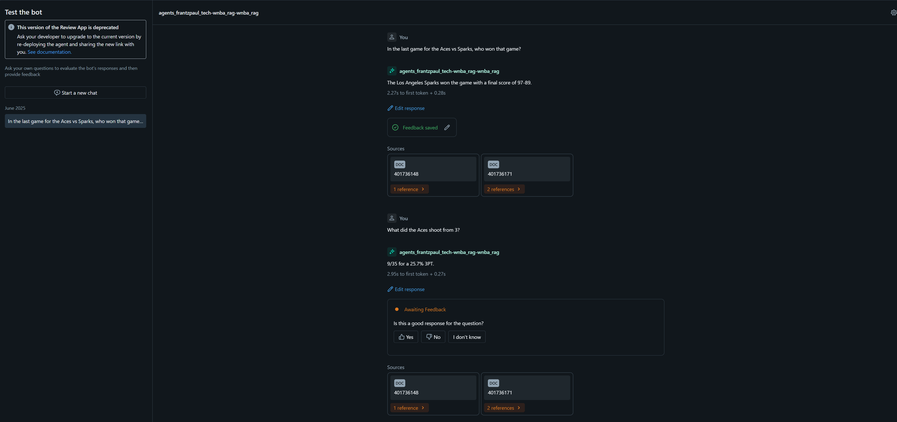
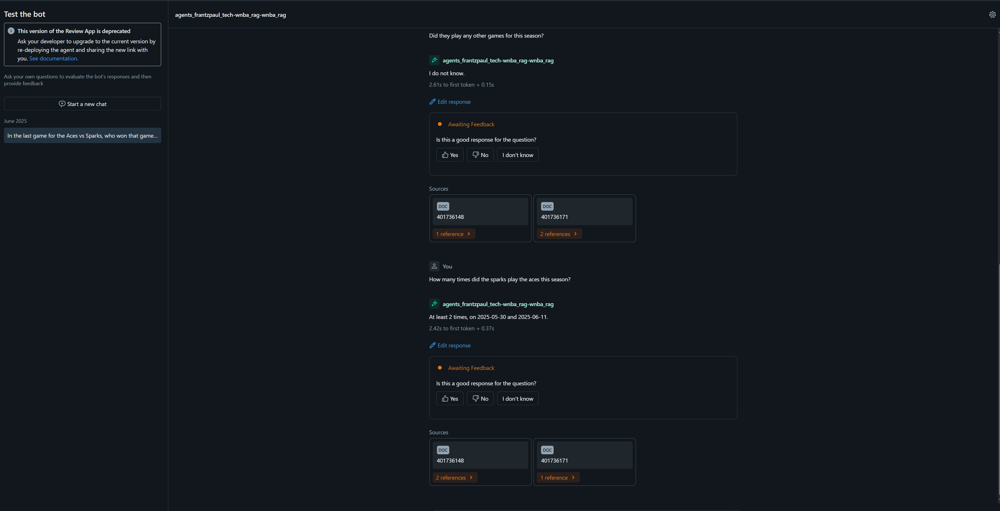
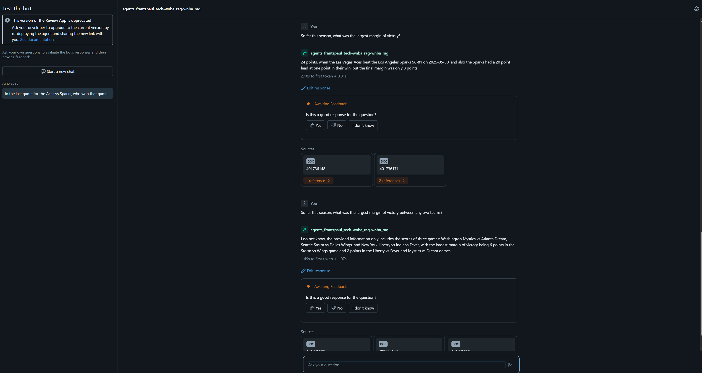

# wnba-llm-chat

This project builds a Retrieval-Augmented Generation (RAG) application and chatbot with message history, focused on WNBA game data. The project was developed on Databricks and modeled after the official Databricks tutorial, which you can find [here](https://notebooks.databricks.com/demos/llm-rag-chatbot/index.html). 

## Dataset

The dataset comes from the [sportsdataverse/wehoop-wnba-data repository](https://github.com/sportsdataverse/wehoop-wnba-data). This is a very neat repository that collects daily game and player data from WNBA games.  For this project, I focused on team data from the 2025 season.Since the dataset is mostly numeric with minimal descriptive text, I generated natural language summaries from the game logs to create meaningful context for embedding. These summaries combine key statistics into short, readable narratives. Here is an example:

  _On 2025-06-11, during the 2025 WNBA season, the Los Angeles Sparks played an away game against the Las Vegas Aces. The final score was 97-89, with the Sparks winning the game. The team recorded 44 points in the paint, 8 fast break points, 24 assists, 5 steals, and 1 block. They had 34 defensive rebounds and 4 offensive rebounds, totaling 38 rebounds. The team shot 33/58 from the field  for a 56.9% FG, 22/27 from the free throw line for a  81.5% FT, and 9/20 from three point range for a 45.0% 3PT. They committed 15 turnovers, leading to 19 opponent points, 2 team turnovers, and had 26 personal fouls, 2 technical fouls (total 2) and 0 flagrant fouls. Their largest lead was 20 points._

### Embeddings

Once the summaries were created, I generated embeddings using the `databricks-gte-large-en` model provided by Databricks. These are what Databricks calls self-managed embeddings. I stored the embeddings and the corresponding summaries in a Delta table, which was later used to power vector search.

## Vector Search Index
Databricks provides the infrastructure for creating the vector search index and providing an endpoint to access the index. It's relatively simple through the Python SDK and the Databricks UI. More information can be found [here](https://docs.databricks.com/aws/en/generative-ai/create-query-vector-search).

## RAG Chain
With the dataset and vector search index ready, the next step was to build the RAG chain and chatbot. This was implemented using LangChain and Databricks-specific integrations.

Although I can't provide a live demo (since keeping the endpoint active incurs cost), here are some screenshots of the chatbot in action.

As shown in this project, Databricks provides a solid environment for developing and testing RAG applications. The integration of vector search, Delta tables, and embedding models makes it a practical platform for experimenting with LLM-based workflows.
## Next Steps

For future development, I'd like to:

- Incorporate **historical data from previous WNBA seasons**
- Include **player-level data** alongside team statistics
- Explore **more advanced chunking and summarization techniques**
- Evaluate **embedding quality and retrieval accuracy**

This project reinforced an important lesson: in LLM applications, data curation and preprocessing are often the most time-consuming and impactful parts of the pipeline. Additionally, robust evaluation is crucial for understanding the system’s performance and guiding improvements.